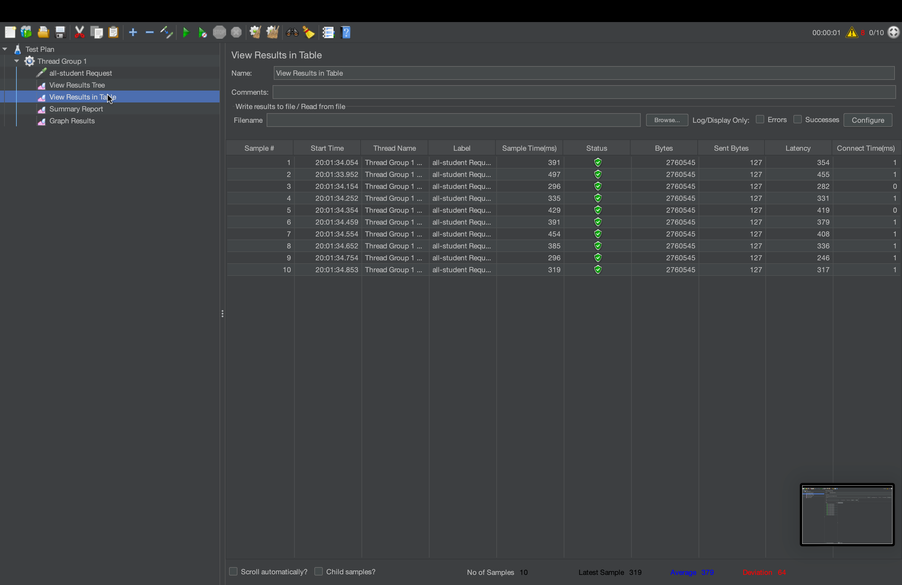
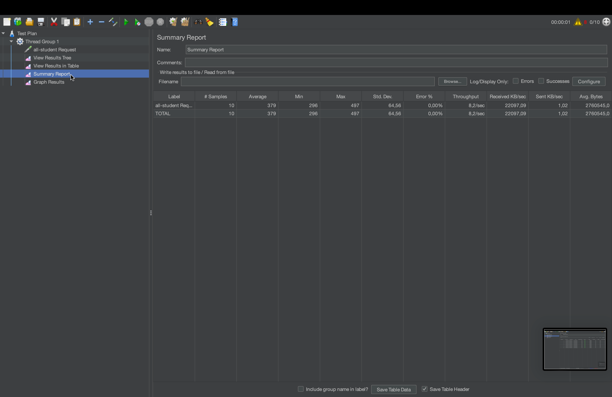
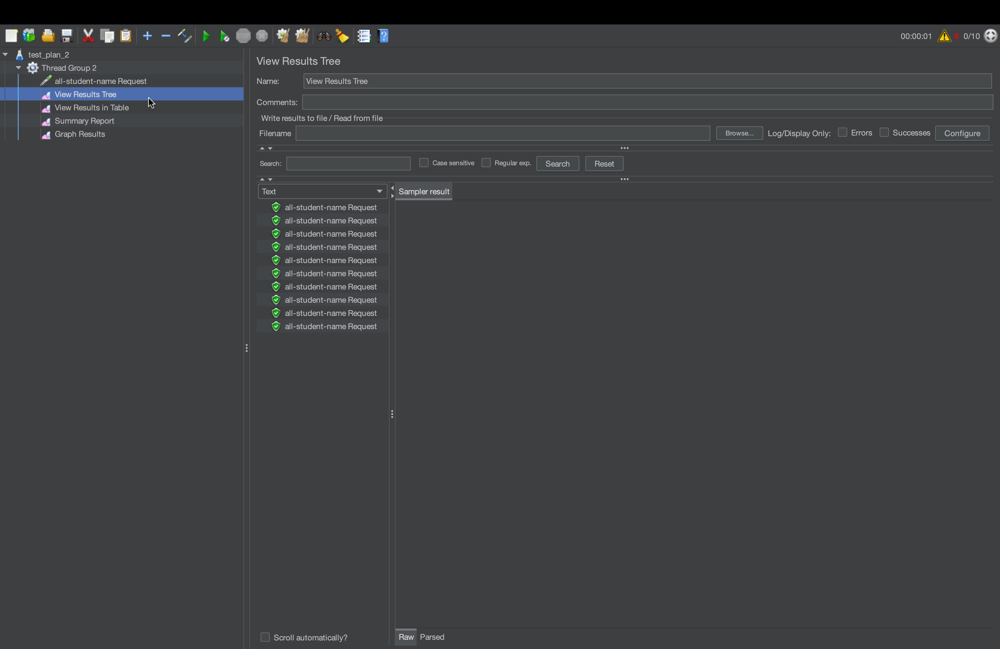
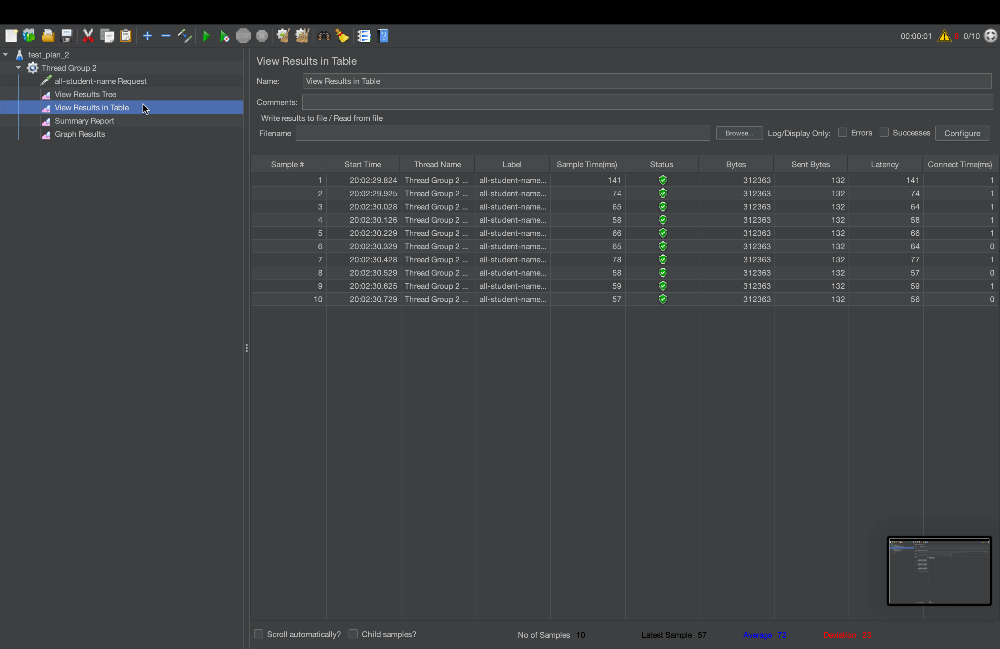
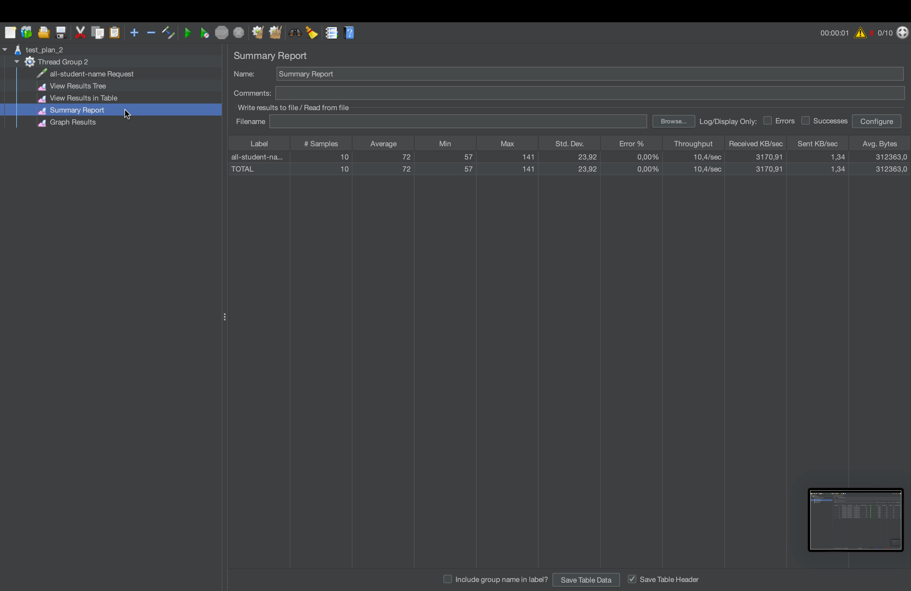
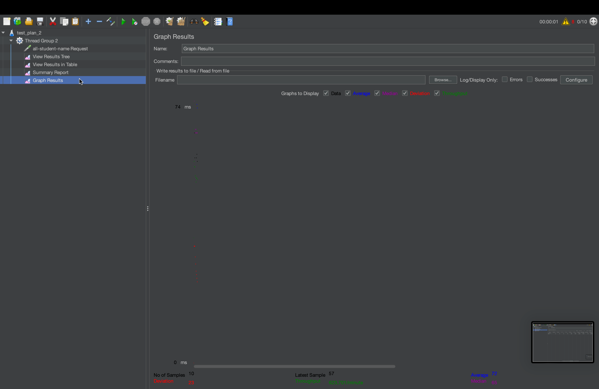
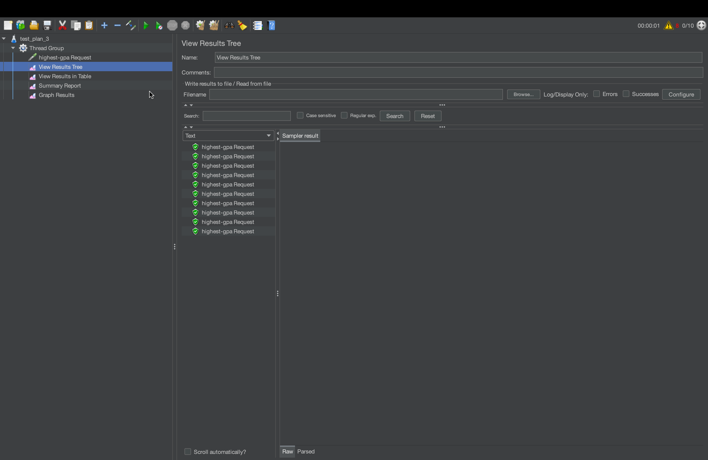
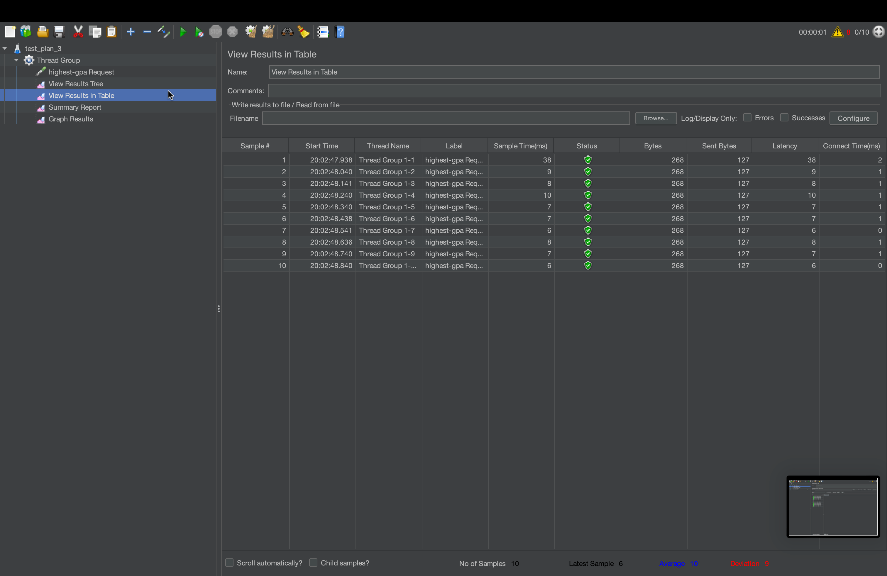
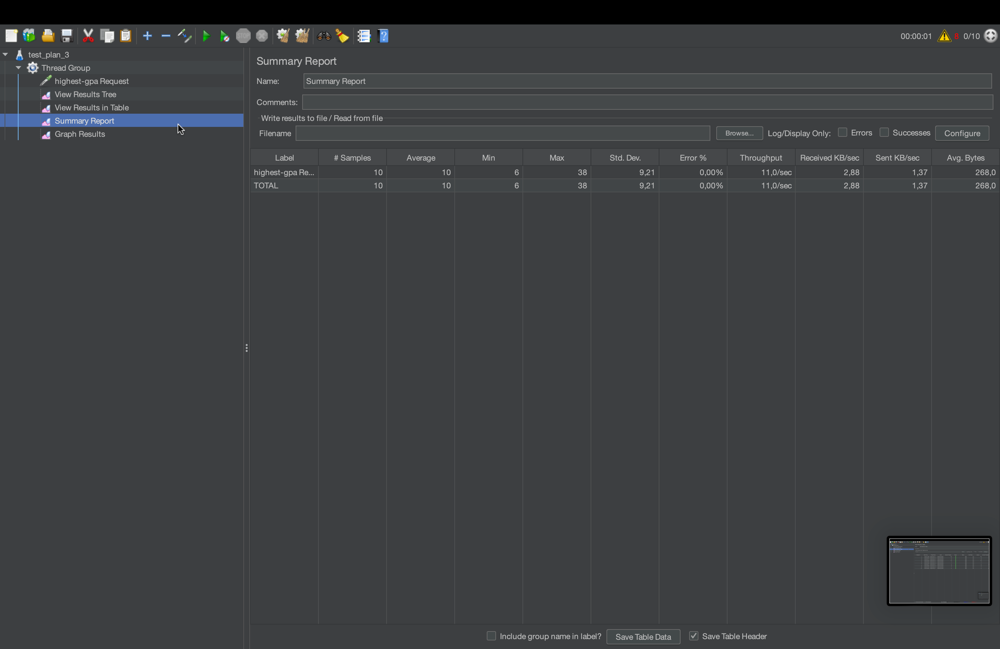

# JMETER RESULTS

## JMETER
### test_plan_1

### test_plan_2

### test_plan_3

## COMMAND LINE
### test_plan_1

### test_plan_2

### test_plan_3

# REFLECTION

1. JMeter tests performance from the outside by simulating real users hitting endpoints and measures response times, throughput, and error rates. It tells you that there is a problem. On the other hand, IntelliJ Profiler works from the inside. It instructs the running JVM and shows CPU time, memory allocation, and method call trees. It tells you where and why the problem exists. In practice you use both together: JMeter to establish a baseline and confirm improvement, IntelliJ Profiler to pinpoint the exact methods to fix.

2. The flame graph and method list in IntelliJ Profiler made it immediately visible that getAllStudentsWithCourses was consuming the most CPU time. Without profiling, you might guess the bottleneck. With it, you can see the exact call stack and how much time each method contributes. This removes guesswork and directs optimization effort to where it actually matters

3. Yes. The combination of the flame graph, timeline, and method list tabs gave a complete picture of application behavior. The method list's CPU time column was particularly useful because it isolated actual processor usage from I/O wait time, making it clear that the bottleneck was the N+1 query loop in getAllStudentsWithCourses rather than network or database latency alone.

4. The main challenge was result inconsistency on the first few runs, because the JVM's JIT compiler is not yet warmed up and produces slower-than-normal times. This was overcome by running the application multiple times and discarding the first measurement, as recommended in the tutorial. Another challenge was understanding which metric to trust. JMeter's sample time vs. IntelliJ's CPU time which was resolved by treating them as complementary rather than competing metrics.

5. The biggest benefit is precision. Rather than broadly rewriting code hoping for improvement, profiling showed specifically that the N+1 query pattern in getAllStudentsWithCourses (1 query per student across 20,000 rows), the full table scan in findStudentWithHighestGpa, and the O(n^2) string concatenation in joinStudentNames were the three real problems. This made optimization targeted and measurable.

6. JMeter measures end-to-end response time including network, serialization, and server overhead, while IntelliJ Profiler measures only CPU execution time inside the JVM. Inconsistencies between the two are expected and normal. When they diverge, the profiler result is trusted for identifying which code to optimize, while JMeter is trusted for measuring the user-facing impact of that optimization. If JMeter shows improvement but the profiler does not and vice versa, it points to the bottleneck being outside the Java code such as database query planning or connection pool overhead.

7. 3 strategies were applied:
   - First, push work to the database rather than doing it in Java by replacing the N+1 loop in getAllStudentsWithCourses with a single JOIN FETCH query, and replacing the full scan in findStudentWithHighestGpa with an ORDER BY gpa DESC LIMIT 1 query. 
   - Second, use efficient data structures by replacing string concatenation with Collectors.joining() which uses StringBuilder internally. 
   - Third, verify correctness after each change by hitting the endpoints directly and confirming the response data is unchanged before re-running JMeter to measure the improvement

# JMETER RESULTS (OPTIMIZED)

## JMETER
### test_plan_1

### test_plan_2

### test_plan_3

